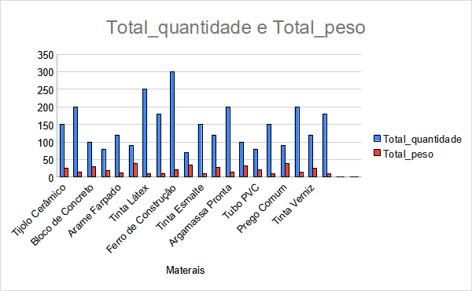
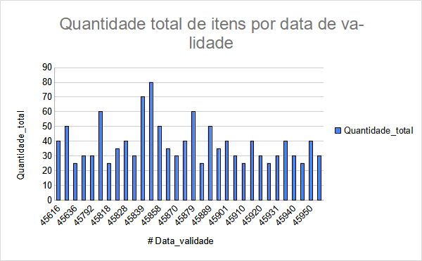
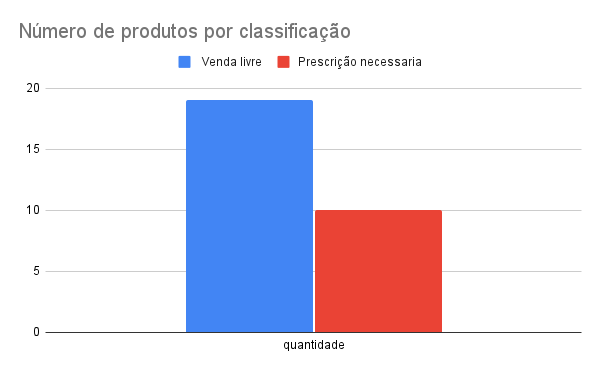
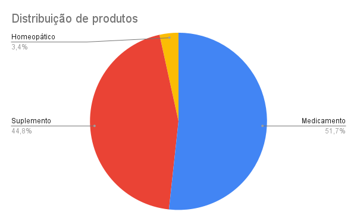

# Consultas SQL

Este repositório contém um conjunto de consultas SQL desenvolvidas para analisar dados de doações em diversas categorias, como equipamentos de comunicação, materiais de limpeza, farmacêuticos, entre outros. Cada consulta foi projetada para extrair informações específicas úteis para a tomada de decisão e análise estatística.

## Como Utilizar

1. **Execução das Consultas:**
   * As consultas SQL estão organizadas por número e podem ser executadas em um ambiente de banco de dados compatível.
   * Cada consulta está devidamente comentada para explicar seu propósito e como os resultados são calculados.
2. **Processo de Criação das Consultas:**
   * **Passo 1:** Identificação dos dados necessários para análise.
   * **Passo 2:** Formulação das consultas SQL para atender aos requisitos específicos de análise.
   * **Passo 3:** Teste das consultas para garantir que os resultados estejam corretos e úteis para o objetivo proposto.
3. **Exemplos e Ilustrações:**
   * Cada consulta pode ser ilustrada com exemplos práticos para demonstrar como os dados são filtrados, agrupados ou contados.
   * A seguir, são fornecidos exemplos detalhados de algumas das consultas disponíveis:

## CONSULTAS SQL

### Consulta 1: Status das Doações por Usuário

<pre>

sql
<button class="flex gap-1 items-center"><svg xmlns="http://www.w3.org/2000/svg" width="24" height="24" fill="none" viewBox="0 0 24 24" class="icon-sm"><path fill="currentColor" fill-rule="evenodd" d="M7 5a3 3 0 0 1 3-3h9a3 3 0 0 1 3 3v9a3 3 0 0 1-3 3h-2v2a3 3 0 0 1-3 3H5a3 3 0 0 1-3-3v-9a3 3 0 0 1 3-3h2zm2 2h5a3 3 0 0 1 3 3v5h2a1 1 0 0 0 1-1V5a1 1 0 0 0-1-1h-9a1 1 0 0 0-1 1zM5 9a1 1 0 0 0-1 1v9a1 1 0 0 0 1 1h9a1 1 0 0 0 1-1v-9a1 1 0 0 0-1-1z" clip-rule="evenodd"></path></svg>Copiar código</button>

<code class="!whitespace-pre hljs language-sql">-- Consulta 1: Selecionar ID do Usuário, ID do Aparelho e Status da Doação
SELECT 
    UsuarioID, 
    AparelhoID, 
    CASE 
        WHEN UsuarioID > 1 THEN 
            CASE 
                WHEN AparelhoID IS NOT NULL THEN AparelhoID 
                ELSE 'Este usuário não fez doação de nenhum aparelho' 
            END 
    END AS STATUS_DA_DOACAO
FROM 
    doacao;
</code>

</pre>

**Descrição:** Esta consulta retorna o ID do usuário, o ID do aparelho doado (se houver) e um status indicando se o usuário realizou alguma doação de aparelho.

---

### Consulta 2: Contagem de Equipamentos de Comunicação por Tipo

<pre>

sql
<button class="flex gap-1 items-center"><svg xmlns="http://www.w3.org/2000/svg" width="24" height="24" fill="none" viewBox="0 0 24 24" class="icon-sm"><path fill="currentColor" fill-rule="evenodd" d="M7 5a3 3 0 0 1 3-3h9a3 3 0 0 1 3 3v9a3 3 0 0 1-3 3h-2v2a3 3 0 0 1-3 3H5a3 3 0 0 1-3-3v-9a3 3 0 0 1 3-3h2zm2 2h5a3 3 0 0 1 3 3v5h2a1 1 0 0 0 1-1V5a1 1 0 0 0-1-1h-9a1 1 0 0 0-1 1zM5 9a1 1 0 0 0-1 1v9a1 1 0 0 0 1 1h9a1 1 0 0 0 1-1v-9a1 1 0 0 0-1-1z" clip-rule="evenodd"></path></svg>Copiar código</button>

<code class="!whitespace-pre hljs language-sql">-- Consulta 2: Contagem de Equipamentos de Comunicação por Tipo
SELECT 
    tipo_de_equipamento, 
    COUNT(*) AS quantidade 
FROM 
    equipamentos_de_comunicacao
GROUP BY 
    tipo_de_equipamento;
</code>

</pre>

**Descrição:** Esta consulta conta quantos equipamentos de comunicação existem para cada tipo específico de equipamento.

---

### Consulta 3: Contagem Total de Equipamentos de Comunicação

<pre>

sql
<button class="flex gap-1 items-center"><svg xmlns="http://www.w3.org/2000/svg" width="24" height="24" fill="none" viewBox="0 0 24 24" class="icon-sm"><path fill="currentColor" fill-rule="evenodd" d="M7 5a3 3 0 0 1 3-3h9a3 3 0 0 1 3 3v9a3 3 0 0 1-3 3h-2v2a3 3 0 0 1-3 3H5a3 3 0 0 1-3-3v-9a3 3 0 0 1 3-3h2zm2 2h5a3 3 0 0 1 3 3v5h2a1 1 0 0 0 1-1V5a1 1 0 0 0-1-1h-9a1 1 0 0 0-1 1zM5 9a1 1 0 0 0-1 1v9a1 1 0 0 0 1 1h9a1 1 0 0 0 1-1v-9a1 1 0 0 0-1-1z" clip-rule="evenodd"></path></svg>Copiar código</button>

<code class="!whitespace-pre hljs language-sql">-- Consulta 3: Contagem Total de Equipamentos de Comunicação
SELECT 
    COUNT(*) AS QUANTIDADE_APARELHO 
FROM 
    equipamentos_de_comunicacao;
</code>

</pre>

**Descrição:** Esta consulta retorna o total de equipamentos de comunicação cadastrados na tabela `equipamentos_de_comunicacao`.

---

### Consulta 4: Selecionar 10 Primeiras Linhas da Tabela Água Potável

<pre>

sql
<button class="flex gap-1 items-center"><svg xmlns="http://www.w3.org/2000/svg" width="24" height="24" fill="none" viewBox="0 0 24 24" class="icon-sm"><path fill="currentColor" fill-rule="evenodd" d="M7 5a3 3 0 0 1 3-3h9a3 3 0 0 1 3 3v9a3 3 0 0 1-3 3h-2v2a3 3 0 0 1-3 3H5a3 3 0 0 1-3-3v-9a3 3 0 0 1 3-3h2zm2 2h5a3 3 0 0 1 3 3v5h2a1 1 0 0 0 1-1V5a1 1 0 0 0-1-1h-9a1 1 0 0 0-1 1zM5 9a1 1 0 0 0-1 1v9a1 1 0 0 0 1 1h9a1 1 0 0 0 1-1v-9a1 1 0 0 0-1-1z" clip-rule="evenodd"></path></svg>Copiar código</button>

<code class="!whitespace-pre hljs language-sql">-- Consulta 4: Selecionar 10 Primeiras Linhas da Tabela Água Potável
SELECT 
    * 
FROM 
    agua_potavel 
LIMIT 10;
</code>

</pre>

**Descrição:** Esta consulta retorna as 10 primeiras linhas da tabela `agua_potavel`, mostrando os dados mais recentes de doações de água potável.

---

### Consulta 5: Contagem de Materiais de Limpeza

<pre>

sql
<button class="flex gap-1 items-center"><svg xmlns="http://www.w3.org/2000/svg" width="24" height="24" fill="none" viewBox="0 0 24 24" class="icon-sm"><path fill="currentColor" fill-rule="evenodd" d="M7 5a3 3 0 0 1 3-3h9a3 3 0 0 1 3 3v9a3 3 0 0 1-3 3h-2v2a3 3 0 0 1-3 3H5a3 3 0 0 1-3-3v-9a3 3 0 0 1 3-3h2zm2 2h5a3 3 0 0 1 3 3v5h2a1 1 0 0 0 1-1V5a1 1 0 0 0-1-1h-9a1 1 0 0 0-1 1zM5 9a1 1 0 0 0-1 1v9a1 1 0 0 0 1 1h9a1 1 0 0 0 1-1v-9a1 1 0 0 0-1-1z" clip-rule="evenodd"></path></svg>Copiar código</button>

<code class="!whitespace-pre hljs language-sql">-- Consulta 5: Contagem de Materiais de Limpeza
SELECT 
    COUNT(*) AS quantidade 
FROM 
    materiais_de_limpeza;
</code>

</pre>

**Descrição:** Esta consulta conta o total de registros na tabela `materiais_de_limpeza`, indicando quantos materiais de limpeza foram cadastrados.

---

### Consulta 6: Selecionar Materiais de Limpeza da Categoria 'Desinfetantes'

<pre>

sql
<button class="flex gap-1 items-center"><svg xmlns="http://www.w3.org/2000/svg" width="24" height="24" fill="none" viewBox="0 0 24 24" class="icon-sm"><path fill="currentColor" fill-rule="evenodd" d="M7 5a3 3 0 0 1 3-3h9a3 3 0 0 1 3 3v9a3 3 0 0 1-3 3h-2v2a3 3 0 0 1-3 3H5a3 3 0 0 1-3-3v-9a3 3 0 0 1 3-3h2zm2 2h5a3 3 0 0 1 3 3v5h2a1 1 0 0 0 1-1V5a1 1 0 0 0-1-1h-9a1 1 0 0 0-1 1zM5 9a1 1 0 0 0-1 1v9a1 1 0 0 0 1 1h9a1 1 0 0 0 1-1v-9a1 1 0 0 0-1-1z" clip-rule="evenodd"></path></svg>Copiar código</button>

<code class="!whitespace-pre hljs language-sql">-- Consulta 6: Selecionar Materiais de Limpeza da Categoria 'Desinfetantes'
SELECT 
    * 
FROM 
    materiais_de_limpeza 
WHERE 
    Categoria = 'Desinfetantes';
</code>

</pre>

**Descrição:** Esta consulta retorna todos os materiais de limpeza da categoria 'Desinfetantes', úteis para análise de produtos específicos de limpeza.

---

### Consulta 7: Selecionar Materiais de Limpeza com Data de Validade Antes de 2025-01-01

<pre>

sql
<button class="flex gap-1 items-center"><svg xmlns="http://www.w3.org/2000/svg" width="24" height="24" fill="none" viewBox="0 0 24 24" class="icon-sm"><path fill="currentColor" fill-rule="evenodd" d="M7 5a3 3 0 0 1 3-3h9a3 3 0 0 1 3 3v9a3 3 0 0 1-3 3h-2v2a3 3 0 0 1-3 3H5a3 3 0 0 1-3-3v-9a3 3 0 0 1 3-3h2zm2 2h5a3 3 0 0 1 3 3v5h2a1 1 0 0 0 1-1V5a1 1 0 0 0-1-1h-9a1 1 0 0 0-1 1zM5 9a1 1 0 0 0-1 1v9a1 1 0 0 0 1 1h9a1 1 0 0 0 1-1v-9a1 1 0 0 0-1-1z" clip-rule="evenodd"></path></svg>Copiar código</button>

<code class="!whitespace-pre hljs language-sql">-- Consulta 7: Selecionar Materiais de Limpeza com Data de Validade Antes de 2025-01-01
SELECT 
    * 
FROM 
    materiais_de_limpeza 
WHERE 
    Categoria = 'Desinfetantes'
    AND Data_validade < '2025-01-01';
</code>

</pre>

**Descrição:** Esta consulta retorna materiais de limpeza da categoria 'Desinfetantes' que têm data de validade antes de 2025, útil para gerenciar estoques e garantir produtos dentro da validade.

---

### Consulta 8: Selecionar Todos os Dados da Tabela Farmacêuticos

<pre>

sql
<button class="flex gap-1 items-center"><svg xmlns="http://www.w3.org/2000/svg" width="24" height="24" fill="none" viewBox="0 0 24 24" class="icon-sm"><path fill="currentColor" fill-rule="evenodd" d="M7 5a3 3 0 0 1 3-3h9a3 3 0 0 1 3 3v9a3 3 0 0 1-3 3h-2v2a3 3 0 0 1-3 3H5a3 3 0 0 1-3-3v-9a3 3 0 0 1 3-3h2zm2 2h5a3 3 0 0 1 3 3v5h2a1 1 0 0 0 1-1V5a1 1 0 0 0-1-1h-9a1 1 0 0 0-1 1zM5 9a1 1 0 0 0-1 1v9a1 1 0 0 0 1 1h9a1 1 0 0 0 1-1v-9a1 1 0 0 0-1-1z" clip-rule="evenodd"></path></svg>Copiar código</button>

<code class="!whitespace-pre hljs language-sql">-- Consulta 8: Selecionar Todos os Dados da Tabela Farmacêuticos
SELECT 
    * 
FROM 
    psa.farmaceuticos;
</code>

</pre>

**Descrição:** Esta consulta retorna todos os registros da tabela `farmaceuticos`, mostrando informações detalhadas sobre os produtos farmacêuticos cadastrados.

---

### Consulta 9: Contagem de Restrição de Venda em Farmacêuticos

<pre>

sql
<button class="flex gap-1 items-center"><svg xmlns="http://www.w3.org/2000/svg" width="24" height="24" fill="none" viewBox="0 0 24 24" class="icon-sm"><path fill="currentColor" fill-rule="evenodd" d="M7 5a3 3 0 0 1 3-3h9a3 3 0 0 1 3 3v9a3 3 0 0 1-3 3h-2v2a3 3 0 0 1-3 3H5a3 3 0 0 1-3-3v-9a3 3 0 0 1 3-3h2zm2 2h5a3 3 0 0 1 3 3v5h2a1 1 0 0 0 1-1V5a1 1 0 0 0-1-1h-9a1 1 0 0 0-1 1zM5 9a1 1 0 0 0-1 1v9a1 1 0 0 0 1 1h9a1 1 0 0 0 1-1v-9a1 1 0 0 0-1-1z" clip-rule="evenodd"></path></svg>Copiar código</button>

<code class="!whitespace-pre hljs language-sql">-- Consulta 9: Contagem de Restrição de Venda em Farmacêuticos
SELECT 
    COUNT(CASE WHEN Nivel_de_Restricao = 'Venda Livre' THEN 1 END) AS venda_livre_count,
    COUNT(CASE WHEN Nivel_de_Restricao = 'Prescrição Necessária' THEN 1 END) AS presc_necessaria_count
FROM 
    farmaceuticos;
</code>

</pre>

**Descrição:** Esta consulta conta quantos produtos farmacêuticos têm restrição de venda livre e prescrição necessária, importante para conformidade regulatória e controle de estoque.

---

### Consulta 10: Selecionar Todos os Dados da Tabela Materiais de Limpeza

<pre>

sql
<button class="flex gap-1 items-center"><svg xmlns="http://www.w3.org/2000/svg" width="24" height="24" fill="none" viewBox="0 0 24 24" class="icon-sm"><path fill="currentColor" fill-rule="evenodd" d="M7 5a3 3 0 0 1 3-3h9a3 3 0 0 1 3 3v9a3 3 0 0 1-3 3h-2v2a3 3 0 0 1-3 3H5a3 3 0 0 1-3-3v-9a3 3 0 0 1 3-3h2zm2 2h5a3 3 0 0 1 3 3v5h2a1 1 0 0 0 1-1V5a1 1 0 0 0-1-1h-9a1 1 0 0 0-1 1zM5 9a1 1 0 0 0-1 1v9a1 1 0 0 0 1 1h9a1 1 0 0 0 1-1v-9a1 1 0 0 0-1-1z" clip-rule="evenodd"></path></svg>Copiar código</button>

<code class="!whitespace-pre hljs language-sql">-- Consulta 10: Selecionar Todos os Dados da Tabela Materiais de Limpeza
SELECT 
    * 
FROM 
    psa.materiais_de_limpeza;
</code>

</pre>

**Descrição:** Esta consulta retorna todos os registros da tabela `materiais_de_limpeza`, mostrando informações detalhadas sobre os materiais de limpeza cadastrados.

---

### Consulta 11: Agrupar Quantidade Total de Cada Tipo de Doação na Tabela Doacao

<pre>

sql
<button class="flex gap-1 items-center"><svg xmlns="http://www.w3.org/2000/svg" width="24" height="24" fill="none" viewBox="0 0 24 24" class="icon-sm"><path fill="currentColor" fill-rule="evenodd" d="M7 5a3 3 0 0 1 3-3h9a3 3 0 0 1 3 3v9a3 3 0 0 1-3 3h-2v2a3 3 0 0 1-3 3H5a3 3 0 0 1-3-3v-9a3 3 0 0 1 3-3h2zm2 2h5a3 3 0 0 1 3 3v5h2a1 1 0 0 0 1-1V5a1 1 0 0 0-1-1h-9a1 1 0 0 0-1 1zM5 9a1 1 0 0 0-1 1v9a1 1 0 0 0 1 1h9a1 1 0 0 0 1-1v-9a1 1 0 0 0-1-1z" clip-rule="evenodd"></path></svg>Copiar código</button>

<code class="!whitespace-pre hljs language-sql">-- Consulta 11: Agrupar Quantidade Total de Cada Tipo de Doação na Tabela Doacao
SELECT
    COUNT(CASE WHEN AguaID IS NOT NULL THEN 1 END) AS Total_Agua,
    COUNT(CASE WHEN AlimentoID IS NOT NULL THEN 1 END) AS Total_Alimentos,
    COUNT(CASE WHEN RoupasID IS NOT NULL THEN 1 END) AS Total_Roupas,
    COUNT(CASE WHEN ItemID IS NOT NULL THEN 1 END) AS Total_Moveis_Eletrodomesticos,
    COUNT(CASE WHEN MaterialID IS NOT NULL THEN 1 END) AS Total_Materiais_Limpeza,
    COUNT(CASE WHEN AparelhoID IS NOT NULL THEN 1 END) AS Total_Equipamentos_Comunicacao,
    COUNT(CASE WHEN FarmaceuticoID IS NOT NULL THEN 1 END) AS Total_Farmaceuticos,
    COUNT(CASE WHEN ConstrucaoID IS NOT NULL THEN 1 END) AS Total_Materiais_Construcao
FROM 
    Doacao;
</code>

</pre>

**Descrição:** Esta consulta agrupa e conta o total de cada tipo de doação registrada na tabela `Doacao`, oferecendo uma visão geral das contribuições recebidas em diferentes categorias.

---

### Consulta 12: Contagem Total de Doações por Usuário

<pre>

sql
<button class="flex gap-1 items-center"><svg xmlns="http://www.w3.org/2000/svg" width="24" height="24" fill="none" viewBox="0 0 24 24" class="icon-sm"><path fill="currentColor" fill-rule="evenodd" d="M7 5a3 3 0 0 1 3-3h9a3 3 0 0 1 3 3v9a3 3 0 0 1-3 3h-2v2a3 3 0 0 1-3 3H5a3 3 0 0 1-3-3v-9a3 3 0 0 1 3-3h2zm2 2h5a3 3 0 0 1 3 3v5h2a1 1 0 0 0 1-1V5a1 1 0 0 0-1-1h-9a1 1 0 0 0-1 1zM5 9a1 1 0 0 0-1 1v9a1 1 0 0 0 1 1h9a1 1 0 0 0 1-1v-9a1 1 0 0 0-1-1z" clip-rule="evenodd"></path></svg>Copiar código</button>

<code class="!whitespace-pre hljs language-sql">-- Consulta 12: Contagem Total de Doações por Usuário
SELECT
    UsuarioID,
    COUNT(*) AS Total_Doacoes
FROM 
    Doacao
GROUP BY 
    UsuarioID;
</code>

</pre>

**Descrição:** Esta consulta conta o número total de doações feitas por cada usuário, útil para identificar os usuários mais ativos em contribuições.

---

### Consulta 13: Média de Quantidade e Peso por Material de Construção

<pre>

sql
<button class="flex gap-1 items-center"><svg xmlns="http://www.w3.org/2000/svg" width="24" height="24" fill="none" viewBox="0 0 24 24" class="icon-sm"><path fill="currentColor" fill-rule="evenodd" d="M7 5a3 3 0 0 1 3-3h9a3 3 0 0 1 3 3v9a3 3 0 0 1-3 3h-2v2a3 3 0 0 1-3 3H5a3 3 0 0 1-3-3v-9a3 3 0 0 1 3-3h2zm2 2h5a3 3 0 0 1 3 3v5h2a1 1 0 0 0 1-1V5a1 1 0 0 0-1-1h-9a1 1 0 0 0-1 1zM5 9a1 1 0 0 0-1 1v9a1 1 0 0 0 1 1h9a1 1 0 0 0 1-1v-9a1 1 0 0 0-1-1z" clip-rule="evenodd"></path></svg>Copiar código</button>

<code class="!whitespace-pre hljs language-sql">-- Consulta 13: Média de Quantidade e Peso por Material de Construção
SELECT 
    Material, 
    AVG(Quantidade) AS Media_Quantidade, 
    AVG(Peso) AS Media_Peso
FROM 
    materiais_de_construcao
GROUP BY 
    Material;
</code>

</pre>

**Descrição:** Esta consulta calcula a média da quantidade e do peso de materiais de construção por tipo de material, fornecendo insights sobre padrões de uso e consumo.

---

### Consulta 14: Contagem Total de Registros por Material de Construção

<pre>

sql
<button class="flex gap-1 items-center"><svg xmlns="http://www.w3.org/2000/svg" width="24" height="24" fill="none" viewBox="0 0 24 24" class="icon-sm"><path fill="currentColor" fill-rule="evenodd" d="M7 5a3 3 0 0 1 3-3h9a3 3 0 0 1 3 3v9a3 3 0 0 1-3 3h-2v2a3 3 0 0 1-3 3H5a3 3 0 0 1-3-3v-9a3 3 0 0 1 3-3h2zm2 2h5a3 3 0 0 1 3 3v5h2a1 1 0 0 0 1-1V5a1 1 0 0 0-1-1h-9a1 1 0 0 0-1 1zM5 9a1 1 0 0 0-1 1v9a1 1 0 0 0 1 1h9a1 1 0 0 0 1-1v-9a1 1 0 0 0-1-1z" clip-rule="evenodd"></path></svg>Copiar código</button>

<code class="!whitespace-pre hljs language-sql">-- Consulta 14: Contagem Total de Registros por Material de Construção
SELECT 
    Material, 
    COUNT(*) AS Total_Registros
FROM 
    materiais_de_construcao
GROUP BY 
    Material;
</code>

</pre>

**Descrição:** Esta consulta conta o total de registros disponíveis para cada tipo de material de construção na tabela `materiais_de_construcao`, útil para monitorar a disponibilidade de diferentes materiais.

---

### Consulta 15: Total de Quantidade e Peso por Material de Construção

<pre>

sql
<button class="flex gap-1 items-center"><svg xmlns="http://www.w3.org/2000/svg" width="24" height="24" fill="none" viewBox="0 0 24 24" class="icon-sm"><path fill="currentColor" fill-rule="evenodd" d="M7 5a3 3 0 0 1 3-3h9a3 3 0 0 1 3 3v9a3 3 0 0 1-3 3h-2v2a3 3 0 0 1-3 3H5a3 3 0 0 1-3-3v-9a3 3 0 0 1 3-3h2zm2 2h5a3 3 0 0 1 3 3v5h2a1 1 0 0 0 1-1V5a1 1 0 0 0-1-1h-9a1 1 0 0 0-1 1zM5 9a1 1 0 0 0-1 1v9a1 1 0 0 0 1 1h9a1 1 0 0 0 1-1v-9a1 1 0 0 0-1-1z" clip-rule="evenodd"></path></svg>Copiar código</button>

<code class="!whitespace-pre hljs language-sql">-- Consulta 15: Total de Quantidade e Peso por Material de Construção
SELECT 
    Material, 
    SUM(Quantidade) AS Total_Quantidade, 
    SUM(Peso) AS Total_Peso
FROM 
    materiais_de_construcao
GROUP BY 
    Material;
</code>

</pre>

**Descrição:** Esta consulta calcula o total de quantidade e peso de materiais de construção por tipo de material, fornecendo uma visão consolidada do consumo de cada material.

## Gráficos Gerados

### Gráfico 1: Total de Quantidade e Peso de Materiais de Construção

Este gráfico de barras compara o total de quantidade e peso de materiais de construção.

### Gráfico 2: Quantidade Total de Itens por Data de Validade (Alimentos)

Este gráfico de linha mostra a quantidade total de itens por data de validade para alimentos.

### Gráfico 3: Número de Medicamentos por Prescrição Médica

Este gráfico de pizza mostra a distribuição do número de medicamentos por prescrição médica (venda livre e por prescrição).

### Gráfico 4: Tipos de Medicamentos Homeopáticos, Suplementos e Medicamentos

Este gráfico de barra agrupa os tipos de medicamentos em homeopáticos, suplementos e medicamentos convencionais.

### Gráfico 5: Número de Medicamentos por Fabricante

Este gráfico de barras horizontais mostra o número de medicamentos por fabricante.

## Como Contribuir

Você é encorajado a contribuir com consultas adicionais ou melhorias para este conjunto de consultas SQL. Para isso, siga estes passos:

1. **Clone o Repositório:** Faça um clone deste repositório para sua máquina local.
2. **Edite ou Adicione Consultas:** Modifique as consultas existentes ou adicione novas consultas conforme necessário.
3. **Envie uma Pull Request:** Após suas alterações, envie uma pull request descrevendo as alterações propostas e os motivos.

## **Conclusão**

As consultas SQL apresentadas neste repositório oferecem uma visão abrangente e detalhada sobre a gestão de doações e recursos em uma organização. Cada consulta foi projetada para extrair informações específicas que são fundamentais para diferentes aspectos operacionais e estratégicos. Aqui estão alguns pontos chave destacados por essas consultas:

1. **Monitoramento e Análise de Doações:** As consultas permitem acompanhar o número total de doações por tipo (água, alimentos, roupas, materiais de limpeza, entre outros) e identificar padrões de doação ao longo do tempo.
2. **Gestão de Recursos:** São oferecidas funcionalidades para contagem e classificação de equipamentos de comunicação, materiais de limpeza e outros recursos essenciais, contribuindo para uma gestão mais eficiente dos estoques e necessidades.
3. **Análise Detalhada de Materiais:** Consultas como a média de quantidade e peso por tipo de material de construção proporcionam insights valiosos para otimização de recursos e planejamento estratégico.
4. **Tomada de Decisão Informada:** A capacidade de visualizar e interpretar os dados através de gráficos e relatórios ajuda na tomada de decisões informadas, desde o gerenciamento diário até estratégias de longo prazo.
5. **Importância da Manutenção do Banco de Dados:** A precisão e a relevância das análises dependem da manutenção regular e da atualização do banco de dados com informações precisas e recentes.
