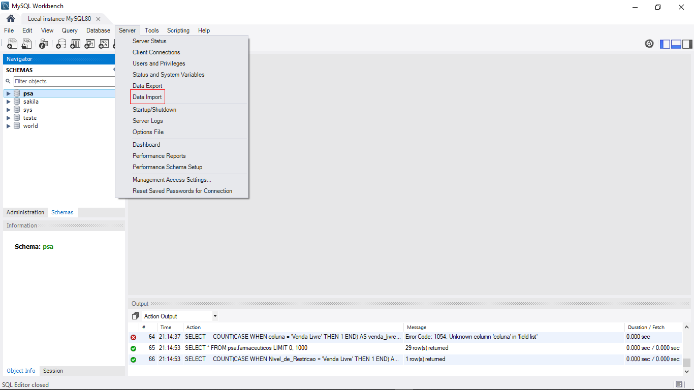
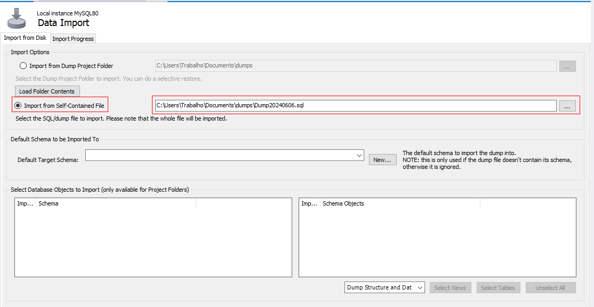
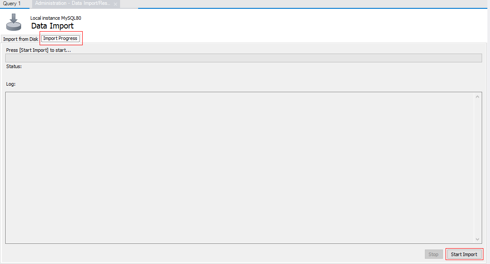

# Instruções de Uso do Banco de Dados MySQL

## Índice

1. [Introdução](#introdu%C3%A7%C3%A3o)
2. [Onde Encontrar os Códigos](#onde-encontrar-os-c%C3%B3digos)
3. [Como Importar o Arquivo Dump](#como-importar-o-arquivo-dump)
4. [Consultas para Teste](#consultas-para-teste)

## Introdução

Este arquivo oferece instruções detalhadas sobre como configurar e usar o banco de dados MySQL. Você aprenderá onde encontrar os códigos necessários, como importar um arquivo dump e como realizar consultas de teste.

## Onde Encontrar os Códigos

Os códigos SQL e os scripts necessários para a configuração do banco de dados podem ser encontrados apenas em no repositório GitHub do projeto. Siga os passos abaixo para acessar:

1. Acesse o repositório no GitHub: [Link do Repositório](https://github.com/Kerubink/Projeto-M3---PDA-)
2. Navegue até o diretório `MySQL` onde os arquivos `.sql` estão localizados.

## Como Importar o Arquivo Dump

Siga estas etapas para importar o arquivo dump do banco de dados:

1. **Baixe o arquivo dump:**
   * No repositório, encontre o arquivo `Dump20240606.sql` e faça o download.
2. **Acesse o MySQL no seu terminal ou interface gráfica:**
   * Use um cliente MySQL como o MySQL Workbench, phpMyAdmin ou o terminal.
3. **Crie um banco de dados:**
   <pre>

sql
<button class="flex gap-1 items-center"><svg xmlns="http://www.w3.org/2000/svg" width="24" height="24" fill="none" viewBox="0 0 24 24" class="icon-sm"><path fill="currentColor" fill-rule="evenodd" d="M7 5a3 3 0 0 1 3-3h9a3 3 0 0 1 3 3v9a3 3 0 0 1-3 3h-2v2a3 3 0 0 1-3 3H5a3 3 0 0 1-3-3v-9a3 3 0 0 1 3-3h2zm2 2h5a3 3 0 0 1 3 3v5h2a1 1 0 0 0 1-1V5a1 1 0 0 0-1-1h-9a1 1 0 0 0-1 1zM5 9a1 1 0 0 0-1 1v9a1 1 0 0 0 1 1h9a1 1 0 0 0 1-1v-9a1 1 0 0 0-1-1z" clip-rule="evenodd"></path></svg>Copiar código</button>

<code class="!whitespace-pre hljs language-sql">CREATE DATABASE psa;
   </code>

</pre>
4. **Importe o arquivo dump:**
   * Via terminal:
     <pre>

sh
<button class="flex gap-1 items-center"><svg xmlns="http://www.w3.org/2000/svg" width="24" height="24" fill="none" viewBox="0 0 24 24" class="icon-sm"><path fill="currentColor" fill-rule="evenodd" d="M7 5a3 3 0 0 1 3-3h9a3 3 0 0 1 3 3v9a3 3 0 0 1-3 3h-2v2a3 3 0 0 1-3 3H5a3 3 0 0 1-3-3v-9a3 3 0 0 1 3-3h2zm2 2h5a3 3 0 0 1 3 3v5h2a1 1 0 0 0 1-1V5a1 1 0 0 0-1-1h-9a1 1 0 0 0-1 1zM5 9a1 1 0 0 0-1 1v9a1 1 0 0 0 1 1h9a1 1 0 0 0 1-1v-9a1 1 0 0 0-1-1z" clip-rule="evenodd"></path></svg>Copiar código</button>

<code class="!whitespace-pre hljs language-sh">mysql -u seu_usuario -p psa < caminho/para/Dump20240606.sql
     </code>

</pre>
   * Via MySQL Workbench:
     * Vá em `Server > Data Import`
       
     * Selecione `Import from Self-Contained File` e escolha o arquivo `Dump20240606.sql`

       
     * Selecione o banco de dados de destino e clique em `Start Import`

       

## Consultas para Teste

Depois de importar o banco de dados, você pode realizar algumas consultas para verificar se tudo está funcionando corretamente.

1. **Selecionar todos os registros de uma tabela:**
   <pre>

sql
<button class="flex gap-1 items-center"><svg xmlns="http://www.w3.org/2000/svg" width="24" height="24" fill="none" viewBox="0 0 24 24" class="icon-sm"><path fill="currentColor" fill-rule="evenodd" d="M7 5a3 3 0 0 1 3-3h9a3 3 0 0 1 3 3v9a3 3 0 0 1-3 3h-2v2a3 3 0 0 1-3 3H5a3 3 0 0 1-3-3v-9a3 3 0 0 1 3-3h2zm2 2h5a3 3 0 0 1 3 3v5h2a1 1 0 0 0 1-1V5a1 1 0 0 0-1-1h-9a1 1 0 0 0-1 1zM5 9a1 1 0 0 0-1 1v9a1 1 0 0 0 1 1h9a1 1 0 0 0 1-1v-9a1 1 0 0 0-1-1z" clip-rule="evenodd"></path></svg>Copiar código</button>

<code class="!whitespace-pre hljs language-sql">SELECT * FROM agua_potavel;
   </code>

</pre>
2. **Contar o número de registros em uma tabela:**
   <pre>

sql
<button class="flex gap-1 items-center"><svg xmlns="http://www.w3.org/2000/svg" width="24" height="24" fill="none" viewBox="0 0 24 24" class="icon-sm"><path fill="currentColor" fill-rule="evenodd" d="M7 5a3 3 0 0 1 3-3h9a3 3 0 0 1 3 3v9a3 3 0 0 1-3 3h-2v2a3 3 0 0 1-3 3H5a3 3 0 0 1-3-3v-9a3 3 0 0 1 3-3h2zm2 2h5a3 3 0 0 1 3 3v5h2a1 1 0 0 0 1-1V5a1 1 0 0 0-1-1h-9a1 1 0 0 0-1 1zM5 9a1 1 0 0 0-1 1v9a1 1 0 0 0 1 1h9a1 1 0 0 0 1-1v-9a1 1 0 0 0-1-1z" clip-rule="evenodd"></path></svg>Copiar código</button>

<code class="!whitespace-pre hljs language-sql">SELECT COUNT(*) FROM doacao;
   </code>

</pre>
3. **Inserir um novo registro:**
   <pre>

sql
<button class="flex gap-1 items-center"><svg xmlns="http://www.w3.org/2000/svg" width="24" height="24" fill="none" viewBox="0 0 24 24" class="icon-sm"><path fill="currentColor" fill-rule="evenodd" d="M7 5a3 3 0 0 1 3-3h9a3 3 0 0 1 3 3v9a3 3 0 0 1-3 3h-2v2a3 3 0 0 1-3 3H5a3 3 0 0 1-3-3v-9a3 3 0 0 1 3-3h2zm2 2h5a3 3 0 0 1 3 3v5h2a1 1 0 0 0 1-1V5a1 1 0 0 0-1-1h-9a1 1 0 0 0-1 1zM5 9a1 1 0 0 0-1 1v9a1 1 0 0 0 1 1h9a1 1 0 0 0 1-1v-9a1 1 0 0 0-1-1z" clip-rule="evenodd"></path></svg>Copiar código</button>

<code class="!whitespace-pre hljs language-sql">INSERT INTO Usuarios (Nome_Usuarios, Email, Endereco, Tipo_de_Usuarios) VALUES 
   ('João', 'Jao@gmail.com', 'Rua dos bobos, 0 - canção infantil - CEP 00000-000', 'Comum'),
   </code>

</pre>
4. **Atualizar um registro existente:**
   <pre>

sql
<button class="flex gap-1 items-center"><svg xmlns="http://www.w3.org/2000/svg" width="24" height="24" fill="none" viewBox="0 0 24 24" class="icon-sm"><path fill="currentColor" fill-rule="evenodd" d="M7 5a3 3 0 0 1 3-3h9a3 3 0 0 1 3 3v9a3 3 0 0 1-3 3h-2v2a3 3 0 0 1-3 3H5a3 3 0 0 1-3-3v-9a3 3 0 0 1 3-3h2zm2 2h5a3 3 0 0 1 3 3v5h2a1 1 0 0 0 1-1V5a1 1 0 0 0-1-1h-9a1 1 0 0 0-1 1zM5 9a1 1 0 0 0-1 1v9a1 1 0 0 0 1 1h9a1 1 0 0 0 1-1v-9a1 1 0 0 0-1-1z" clip-rule="evenodd"></path></svg>Copiar código</button>

<code class="!whitespace-pre hljs language-sql">UPDATE alimentos SET nome = "arroz branco" WHERE ID_Alimentos = 1;
   </code>

</pre>
5. **Deletar um registro:**
   <pre>

sql
<button class="flex gap-1 items-center"><svg xmlns="http://www.w3.org/2000/svg" width="24" height="24" fill="none" viewBox="0 0 24 24" class="icon-sm"><path fill="currentColor" fill-rule="evenodd" d="M7 5a3 3 0 0 1 3-3h9a3 3 0 0 1 3 3v9a3 3 0 0 1-3 3h-2v2a3 3 0 0 1-3 3H5a3 3 0 0 1-3-3v-9a3 3 0 0 1 3-3h2zm2 2h5a3 3 0 0 1 3 3v5h2a1 1 0 0 0 1-1V5a1 1 0 0 0-1-1h-9a1 1 0 0 0-1 1zM5 9a1 1 0 0 0-1 1v9a1 1 0 0 0 1 1h9a1 1 0 0 0 1-1v-9a1 1 0 0 0-1-1z" clip-rule="evenodd"></path></svg>Copiar código</button>

<code class="!whitespace-pre hljs language-sql">DELETE FROM usuarios WHERE Nome_Usuarios = "nome do usuario que deseja deletar";
   </code>

</pre>

## Conclusão

Parabéns! Agora você está pronto para utilizar o banco de dados MySQL em seu projeto. Aqui está um resumo dos passos que você seguiu:

1. **Encontrar os Códigos** :

* Localizou os arquivos e scripts necessários no repositório.

1. **Importar o Arquivo Dump** :

* Utilizou o comando `mysql` para importar os dados do arquivo Dump20240606.sql e configurar seu banco de dados.

1. **Executar Consultas de Teste** :

* Realizou consultas de teste para garantir que o banco de dados está funcionando corretamente.

Lembre-se de verificar se todas as dependências estão instaladas e configuradas corretamente antes de iniciar seu trabalho com o banco de dados. Se você encontrar qualquer problema ou tiver dúvidas, não hesite em consultar a documentação oficial do MySQL ou entrar em contato com os administradores do projeto.

Boa sorte com seu desenvolvimento, e aproveite ao máximo a utilização do nosso banco de dados MySQL!

---

### Referências

* [Documentação do MySQL](https://dev.mysql.com/doc/)
* [Markdown Guide](https://www.markdownguide.org/)

---

Se precisar de mais ajuda, sinta-se à vontade para abrir uma issue no repositório ou entrar em contato diretamente com a equipe de desenvolvimento.

Boas consultas e bom desenvolvimento!
