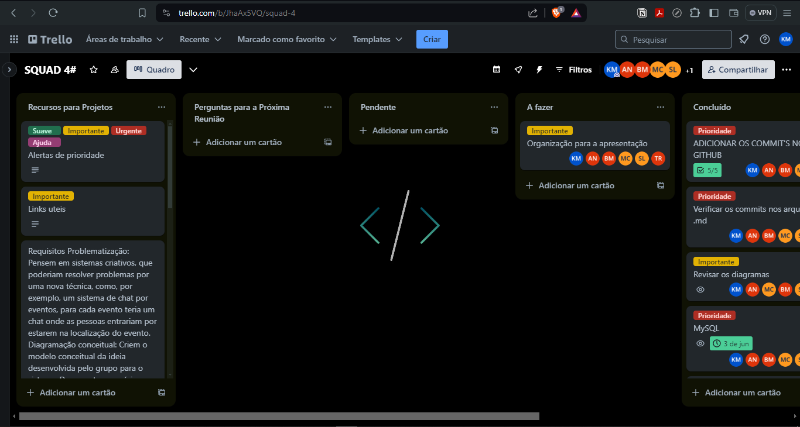

# Portal de Socorro e Apoio (PSA)

## Descrição da Organização

O **Portal de Socorro e Apoio (PSA)** é uma plataforma inovadora e integrada, idealizada em resposta aos desastres recentes no Rio Grande do Sul, dedicada a fornecer assistência rápida e eficaz para pessoas em situação de vulnerabilidade, especialmente em casos de desastres naturais como enchentes, terremotos, incêndios e outras emergências. Desenvolvido para facilitar a gestão de recursos e a coordenação de ajuda humanitária, o PSA visa conectar doadores, voluntários e organizações de apoio para maximizar o impacto das ações de socorro.

## Missão

O PSA tem como missão salvar vidas e aliviar o sofrimento de pessoas afetadas por desastres, promovendo a solidariedade e a cooperação comunitária. A plataforma busca ser um ponto central de apoio, garantindo que recursos vitais cheguem rapidamente a quem mais precisa e que os esforços de ajuda sejam coordenados de forma eficaz e transparente.

Com o PSA, transformamos a solidariedade em ação, criando uma rede forte e eficiente de socorro e apoio em tempos de crise.

## Organização do Projeto

Para garantir a eficiência e a transparência na execução do projeto, nossa equipe adotou uma série de ferramentas e métodos colaborativos:

* **Trello e Notion:** Utilizamos o Trello para gerenciar nossas tarefas e acompanhar o progresso das atividades. O Notion foi utilizado para documentar todos os aspectos do projeto, incluindo requisitos, diagramas, e decisões de design.
* 
* **Reuniões via Discord:** Realizamos reuniões regulares via Discord para discutir o andamento do projeto, alinhar estratégias e tomar decisões importantes. Essas reuniões foram fundamentais para manter a comunicação entre os membros da equipe e resolver quaisquer dúvidas ou problemas que surgiram ao longo do caminho.
* **Live Share para codificação:** Para facilitar a colaboração no desenvolvimento de código, utilizamos a extensão Live Share do Visual Studio Code. Isso permitiu que os membros da equipe trabalhassem simultaneamente no mesmo código, realizassem revisões de código em tempo real e resolvessem problemas de forma colaborativa.

Essas práticas ajudaram a manter o projeto organizado, promoveram uma comunicação eficaz e maximizaram a produtividade da equipe durante todo o processo de desenvolvimento.

## Estrutura do Projeto

### 1. Diagramas

- **Diagrama Conceitual**: Representa as entidades principais e seus relacionamentos de alto nível.
- **Diagrama Lógico**: Detalha a estrutura do banco de dados, incluindo tabelas, colunas, tipos de dados e relacionamentos.

### 2. Banco de Dados

- **MySQL Workbench**: Utilizamos o MySQL Workbench para criar e gerenciar o banco de dados.
- **Script SQL**: Incluímos um script SQL que contém todos os comandos necessários para criar o banco de dados e as tabelas, inserir dados de exemplo e realizar consultas básicas.

## Como Utilizar

### Pré-requisitos

- [MySQL](https://www.mysql.com/downloads/)
- [MySQL Workbench](https://www.mysql.com/products/workbench/)

### Passos para Configuração

1. **Clone o Repositório**

   ```bash
   git clone https://github.com/Kerubink/Projeto-M3---PDA-.git
   cd seu-repositorio
   ```
2. **Abrir o MySQL Workbench**

   - Abra o MySQL Workbench e conecte-se ao seu servidor MySQL.
3. **Importar o Script SQL**

   - Navegue até o menu `File` > `Open SQL Script` e selecione o arquivo `database_script.sql` localizado no repositório clonado.

   > `Para mais informações acesse o arquivo de instruções na pasta MySQL`
   >
4. **Executar o Script**

   - Execute o script SQL para criar o banco de dados e as tabelas necessárias.

### Consultas de Teste

Após importar e executar o script SQL, você pode realizar algumas consultas de teste para garantir que o banco de dados foi configurado corretamente. Você pode encontrar mais consultas exemplos no arquivo `INSTRUCTIONS.md`.

```sql
-- Exemplo de consulta para verificar dados inseridos em uma tabela
SELECT * FROM Agua_Potavel;

-- Exemplo de consulta para verificar o relacionamento entre tabelas
SELECT *
FROM Doacao d
JOIN Usuarios u ON d.UsuarioID = u.ID_Usuarios
JOIN Instituicao i ON d.InstituicaoID = i.ID_Instituicao;
```

## Estrutura do Banco de Dados

### Algumas tabelas do nosso banco

- **Agua_Potavel**

  - `ID_Agua`: Identificador único.
  - `Volume`: Volume em litros.
  - `Data_de_Validade`: Data de validade da embalagem.
  - `Nivel_de_Urgencia`: Nível de urgência (1 - Baixa, 2 - Média, 3 - Alta).
  - `Embalagem`: Tipo de embalagem.
  - `Descricao`: Descrição da água potável.
  - `Fornecedor`: Nome do fornecedor.
- **Alimentos**

  - `ID_Alimentos`: Identificador único.
  - `Nome`: Nome do alimento.
  - `Categoria`: Categoria do alimento.
  - `Data_de_Validade`: Data de validade do alimento.
  - `Quantidade`: Quantidade em quilogramas.
  - `Descricao`: Descrição do alimento.
  - `Nivel_de_Urgencia`: Nível de urgência. (1 - Baixa, 2 - Média, 3 - Alta).
  - `Fornecedor`: Nome do fornecedor.
- **Usuarios**

  - `ID_Usuarios`: Identificador único.
  - `Nome_Usuarios`: Nome do usuário.
  - `Email`: Email do usuário (único).
  - `Endereco`: Endereço do usuário.
  - `Tipo_de_Usuarios`: Tipo de usuário.
  - `ID_Instituicao`: Identificador da instituição associada.
- **Instituicao**

  - `ID_Instituicao`: Identificador único.
  - `Nome_Instituicao`: Nome da instituição.
  - `Email`: Email da instituição.
  - `Telefone`: Telefone da instituição.
  - `Enderecos`: Endereço da instituição.
  - `Descricao`: Descrição da instituição.
- **Voluntarios**

  - `ID_Voluntario`: Identificador único.
  - `Nome_Voluntario`: Nome do voluntário.
  - `Disponibilidade`: Disponibilidade do voluntário.
  - `Habilidades`: Habilidades do voluntário.
  - `Email`: Email do voluntário.
  - `Telefone`: Telefone do voluntário.
  - `Descricao`: Descrição do voluntário.

### Relacionamentos

- **Doacao**: Relaciona usuários, instituições e itens doados (água, alimentos, roupas, etc.).
- **Instituicao_Voluntarios**: Relaciona instituições e voluntários.
- **Instituicao_Assistencia**: Relaciona instituições e assistência técnica.
- **Usuario_Instituicao**: Relaciona usuários e instituições.

## Conclusão

Este projeto proporcionou uma compreensão mais profunda sobre a modelagem de banco de dados e a implementação prática utilizando MySQL. Agradecemos pela oportunidade de aplicar nossos conhecimentos e habilidades adquiridos ao longo do curso. Se você encontrar qualquer problema ou tiver perguntas, sinta-se à vontade para abrir uma issue no repositório ou entrar em contato com qualquer um dos contribuidores.

## Contribuidores


### Líder

- **Kauã Kelvyn**
  
  Desenvolvedor Fullstack - Líder
  - GitHub: [Kerubink](https://github.com/Kerubink)
  - LinkedIn: [Kauã Kelvyn](https://www.linkedin.com/in/kau%C3%A3-moraes-079288303/)

### Comunicador

- **Samuel**
  
  Desenvolvedor Fullstack - Comunicador
  - GitHub: [Samuel-Kepler](https://github.com/Samuel-Kepler)
  - LinkedIn: [Samuel](https://www.linkedin.com/in/samuel-ribeiro-loiola)

### Gestor de Conhecimento

- **Miszael**
  
  Desenvolvedor Fullstack - Gestor de Conhecimento
  - GitHub: [minu1123](https://github.com/minu1123)
  - LinkedIn: [Miszael](https://www.linkedin.com/in/miszael-costa-19b0b4251/)

### Colaboradores

- **Ana**
  
  Desenvolvedora Fullstack - Colaboradora

  - GitHub: [Ana-Neves](https://github.com/Ana-Neves)
  - LinkedIn: [Ana](https://www.linkedin.com/in/ana-caroline-neves-fullstack/)
- **Beatriz**
  
  Desenvolvedora Fullstack - Colaboradora

  - GitHub: [l1Beatriz](https://github.com/l1Beatriz)
  - LinkedIn: [Beatriz](https://www.linkedin.com/in/beatrizsantos009?utm_source=share&utm_campaign=share_via&utm_content=profile&utm_medium=android_app)
